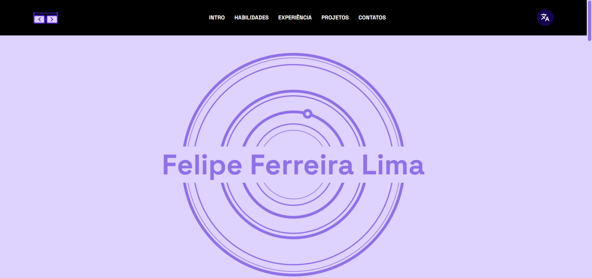
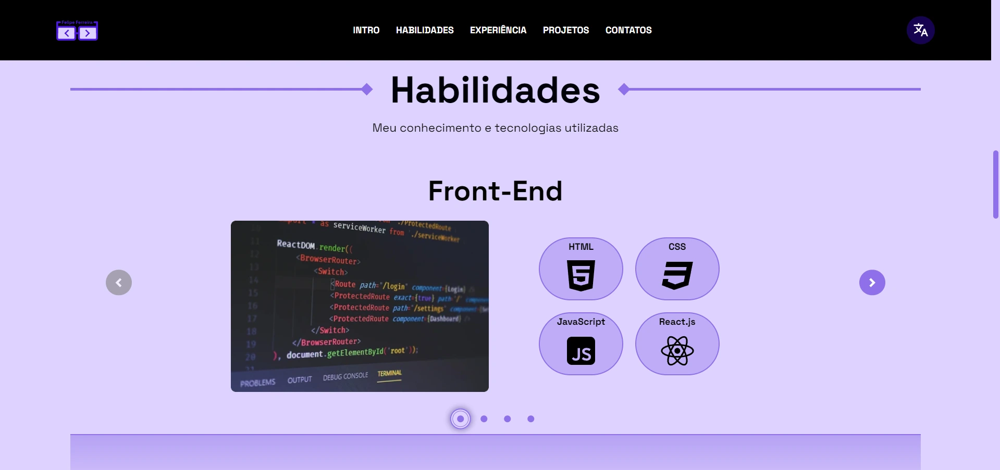
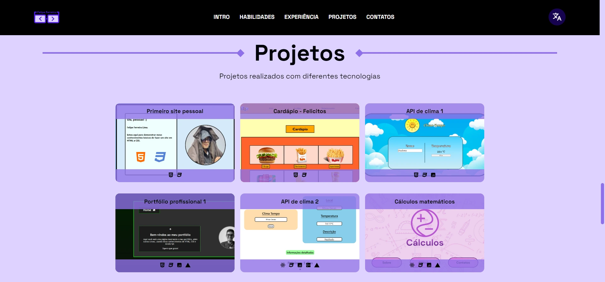
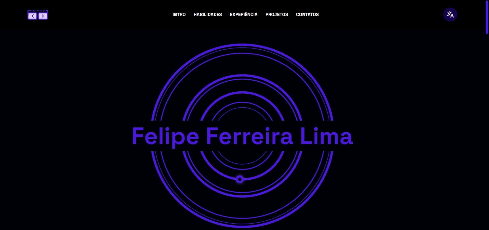
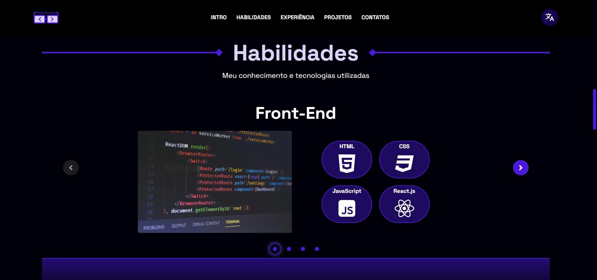
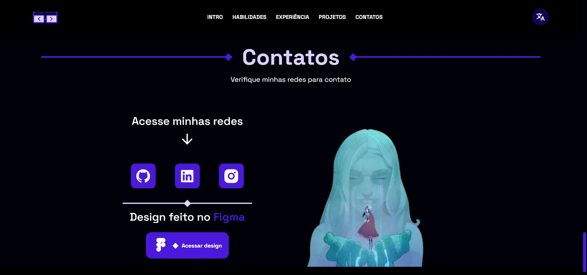

<h1>🔵 Portfólio 🔵</h1>

## 🖱️ Índice

- <a href="#-sobre">Sobre</a>
- <a href="#-descrição">Descrição</a>
  - <a href="#-estruturação">Estruturação</a> 
  - <a href="#-seções">Seções</a> 
  - <a href="#-funcionalidades">Funcionalidades</a> 
- <a href="#-tecnologias">Tecnologias</a>
- <a href="#️-preview">Preview</a>
- <a href="#-autor">Autor</a>

****

## ❓ Sobre

Portfólio desenvolvido para apresentar minhas habilidades, projetos e experiências. O design foi planejado no Figma e implementado utilizando o framework React com Vite.

A seguir, você encontrará informações gerais sobre o projeto e sobre o autor.

****

## 📃 Descrição
- #### 📁 Estruturação
  
  - **public/**
    - **archives/** - arquivos que carregam arquivos PDF (apenas currículo)
    - **locales/** - arquivos JSON de tradução (`en/` e `pt-BR/`)
    - **logo.svg** - logo do projeto
    - **robots.txt** - arquivo para rastreamento do Google
  
  - **src/**
    - **assets/** - arquivos de imagem e SVGs, separados por seção
      - **imgs/**
      - **svgs/**
    - **components/** - componentes do projeto, como o `Header`, `Main`, seções do projeto, título da seção, carrossel, entre outros.
    - **pages** - páginas do projeto, no caso, apenas `Home`
    - **services/** - arquivos que oferecem funções ou dados para o resto do projeto
      - **context/** - guarda o arquivo de mudança de tema do projeto (claro e escuro)
      - **i18n/** - guarda o arquivo de inicialização do i18n de tradução
      - **utils** - guarda os hooks personalizados (ex: `GSAP`, rolagem) e dados utilizados para os componentes (imagens, ícones e "mock" de banco de dados)

- #### 🔷 Seções
  - **Intro** - apresentação inicial, com o resumo sobre mim, meus hobbies e meus objetivos
  - **Habilidades** - demonstração das minhas habilidades através de tópicos separados: Front-end, Back-end, Banco de dados e Ferramentas
  - **Experiência** - experiências anteriores relevantes
  - **Projetos** - projetos construídos utilizando diferentes tecnologias (HTML, CSS, React, Java, etc.)
  - **Contatos** - links das minhas redes sociais e referência ao design do Figma

- #### 📱 Funcionalidades
  
  - **Tema principal** - é possível alterar o tema do site clicando na logo do header, escolhendo entre o círculo azul claro ou escuro
  - **Tradução** - ao clicar no ícone de tradução (lado direito do header), é possível clicar em <code>POR</code> muda para o português e <code>ENG</code> para trocar para inglês

****

## 💻 Tecnologias

- **[React](https://react.dev)** - framework de contrução de interfaces
- **[Vite](https://vite.dev)** - ferramenta de build rápida e otimizada utilizada junto com React
- **[i18n](https://www.i18next.com)** - biblioteca de tradução
- **[GSAP](https://gsap.com)** - biblioteca para animações interativas e suaves em JavaScript
- **[Embla Carousel](https://www.embla-carousel.com)** - biblioteca para carrosséis customizáveis
- **[Iconify](https://iconify.design)** - biblioteca de ícones
- **[Figma](https://www.figma.com)** - design para o projeto ([Visualizar design](https://www.figma.com/design/vGYB5KQPySdayZVni0t6no/Design-%7C-Portf%C3%B3lio?node-id=62-1215&t=2LrlV2kYf5y5eu60-1))

****

## 🖼️ Preview

🔗 [Acesso ao portfólio]()

- #### Tema claro

- #### Tema escuro 

****

## 👨‍💻 Autor

Desenvolvido por **Felipe Ferreira Lima**

